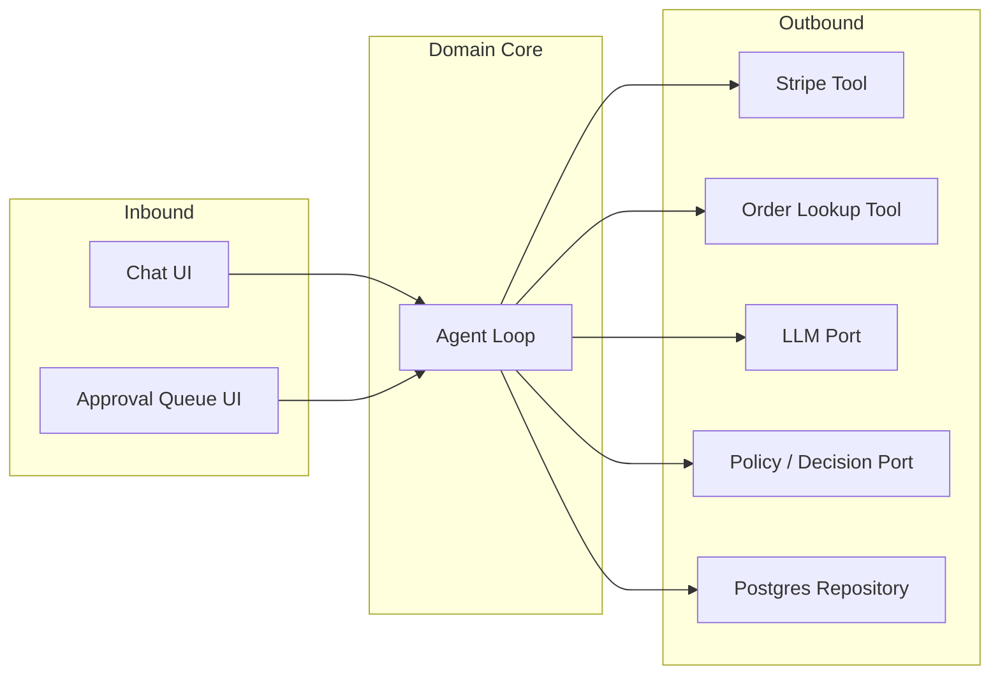

# Architecture — AI Payment Refund Agent

This document explains *why* the system is shaped the way it is, for anyone reading the code for the first time — a contributor, a reviewer, or future-you six months from now. It's written to accompany [`ARCHITECTURE-SPINE.md`](./ARCHITECTURE-SPINE.md), the terse machine-and-builder-facing contract this project is built from. If the two ever disagree, the spine wins; this document exists to make the spine's reasoning legible, not to redefine it.

## What this project is

A Stripe-backed customer refund chatbot, built as one feature that evolves through twelve stages — from a bare LLM API call to a production-grade agentic system with real guardrails, evaluation, and multi-agent orchestration. It's deliberately built by hand rather than on top of an agent framework (LangGraph, CrewAI, etc.), because the point of the project is to understand how those frameworks' core ideas work underneath, not to configure one.

## The core idea: Hexagonal / Ports & Adapters

At the center of this system is the **Agent Loop** — the perceive → decide → act → observe cycle that resolves a refund request. Everything else in the system is either something that *drives* the loop (a customer's chat message, a staff member's approval decision) or something the loop *drives* (calling Stripe, looking up an order, calling an LLM).

This is a well-known pattern called **Hexagonal Architecture**, or **Ports & Adapters**. The mental model: picture the Agent Loop sitting in the middle of a hexagon. Every side of the hexagon is a **port** — an interface the domain defines for something it needs (a way to call a payment provider, a way to check policy, a way to persist state). Outside each port sits an **adapter** — the concrete, swappable implementation (a Stripe adapter today, maybe a PayPal adapter tomorrow, without touching the Agent Loop at all).

**Why this pattern, specifically:** two of this project's own requirements ("the Agent Loop must be wrappable as a Sub-agent later" and "the MVP's hardcoded policy rules must be swappable for real RAG-based policy checking later") are *exactly* what Ports & Adapters is built to make cheap. Choosing this pattern isn't decoration — it's the natural home for constraints the project already committed to.

**The one rule that keeps this real:** code in `domain/` never imports from `adapters/` or `api/`. If you're writing domain logic and find yourself importing something Stripe-specific, that's a sign the port needs a new method, not that the rule should bend.

## The decisions that matter (and why)

The spine records these as `AD`s (architecture decisions) — terse, enforceable rules. Here's the reasoning behind the ones that aren't obvious from the code alone.

### The Agent Loop has exactly one door in

`run(input) -> AgentResult` is the *only* way to drive the loop — including resuming after a human reviewer makes a decision. It would be simpler, at first glance, to add a second method for "resume." We didn't, because a future Orchestrator (coordinating multiple specialist Sub-agents) needs to treat every Agent Loop instance identically, whether it's running fresh or picking back up after a pause. One door, two kinds of key (`NewRequestInput` and `ResumeInput`) — never two doors.

### Escalation doesn't block — it ends and gets resumed

When the agent isn't confident enough to act on its own, it doesn't sit there waiting for a human. It returns cleanly with an `Escalated` result, saves its state, and the request is picked back up later — by the same `run()` entry point, once a reviewer acts. This mirrors how real production systems handle human-in-the-loop work (durable, resumable execution), rather than the simpler-but-fragile pattern of holding a connection open.

### The Trajectory log never lies to you — and never forgets

Every step the agent takes (a tool call, a decision, an escalation) gets written as its own permanent, ordered record — never edited, never deleted. This is what makes the system's reasoning genuinely inspectable after the fact, and it's what evaluation (comparing real runs against a "golden" dataset) is built on top of.

The catch we had to design around: if a record is *permanent*, anything sensitive that accidentally lands in one is permanent too. So every step type has an explicit allowlist of what's allowed to be written — raw payloads (a receipt image, a full API response) are redacted down to just the allowlisted fields *before* they're ever saved, not after.

### Money-safety is layered, not single-point

Preventing a duplicate refund isn't one check — it's two, both inside the domain, never delegated to an adapter:

1. **At intake** — if two chat messages look like the same request (same order, same reason, close in time), they collapse into one `RefundRequest`, not two.
2. **At the point of payment** — every call that actually moves money carries an idempotency key tied to that one request, so even a network retry can't double-charge or double-refund.

Either check alone isn't enough — the first prevents "two rows for one real request," the second prevents "one row triggering payment twice." A payments system this small still needs both.

### Confidence and policy are pluggable, on purpose

Right now, "is this refund policy-compliant?" is answered by a few simple hardcoded rules (order exists, within the return window, amount matches). Later, that gets replaced by a real policy-lookup system (RAG over the store's actual refund policy documents). Because both live behind the same `PolicyDecision` interface from day one, that swap is a matter of writing a new adapter — not rewriting the Agent Loop that depends on it.

The same logic applies to how confident the agent is in its own decision: that computation lives entirely in the domain core, fed by raw signals from adapters (never a pre-baked "confidence number" from an adapter itself) — so the method for computing confidence can evolve without every adapter needing to agree on a shared formula.

### The stack, and why each piece was picked

| Piece | Choice | Why |
|---|---|---|
| Backend | Python + FastAPI | Python is the dominant language across the AI/agent ecosystem — this project is partly about building fluency there. FastAPI's typed, decorator-based style makes for a gentle re-entry point even after time away from Python. |
| Data validation | Pydantic v2 | Structured, typed request/response shapes — directly supports requirements like "always return extracted fields in a fixed schema." (Note: this is *not* the same project as "Pydantic AI," an agent framework we're deliberately not building on.) |
| Frontend | React / Next.js | A real, separately-deployable frontend — genuinely "full-stack," not one framework doing everything. |
| Database | PostgreSQL, hosted on Neon | One relational store for everything (orders, requests, the trajectory log, the approval queue) keeps this hobby-scale project simple. Neon specifically because its free tier is a real, permanent tier — unlike some competitors that quietly expire a free database after 30 days, which would be a strange thing to discover mid-demo. |
| Backend hosting | Render | The backend itself holds no state (all of it lives in Postgres), so a low-cost, occasionally-sleeping host costs nothing in reliability. |
| Frontend hosting | Vercel | The natural, zero-config home for a Next.js app. |

## How to extend this safely

If you're adding a new capability to this project, the questions worth asking before writing code:

- **Am I adding something the domain needs from the outside world?** → It's a new port method, implemented by a new or existing adapter. The domain should never need to know *which* adapter it's talking to.
- **Am I adding a new kind of step the agent takes?** → It gets logged as a new `TrajectoryEvent` type, with its own field allowlist decided up front (see "The Trajectory log never lies to you," above) — not a free-form blob.
- **Am I changing what counts as "approved" or "escalated"?** → That logic lives in the domain core alone. If you find yourself writing approval logic inside an adapter or the API layer, stop — that's exactly the kind of drift this architecture exists to prevent.
- **Not sure whether something belongs in the spine?** → A good test: *if two people built this independently, could they reasonably build it two different, incompatible ways?* If yes, it probably deserves a rule in [`ARCHITECTURE-SPINE.md`](./ARCHITECTURE-SPINE.md). If no — it's just an implementation detail, and belongs in the code, not the spine.

## What's intentionally left open

Some things aren't decided yet, on purpose — see the spine's Deferred section for the full list, but notably: the exact dollar amount that requires human approval, the specific LLM provider/model, and the Orchestrator's internal routing logic once multi-agent orchestration is actually built. None of these affect the shape of the system — they're free to change without touching any of the rules above.
