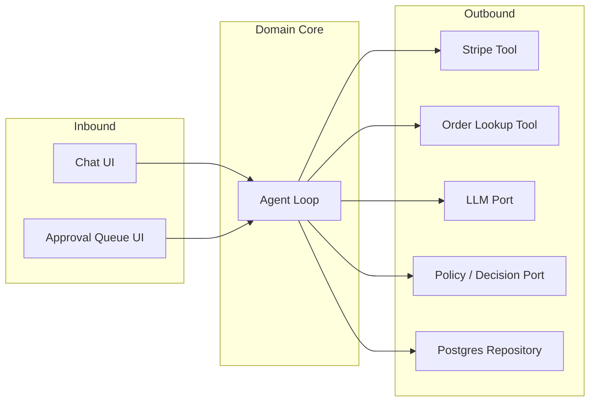
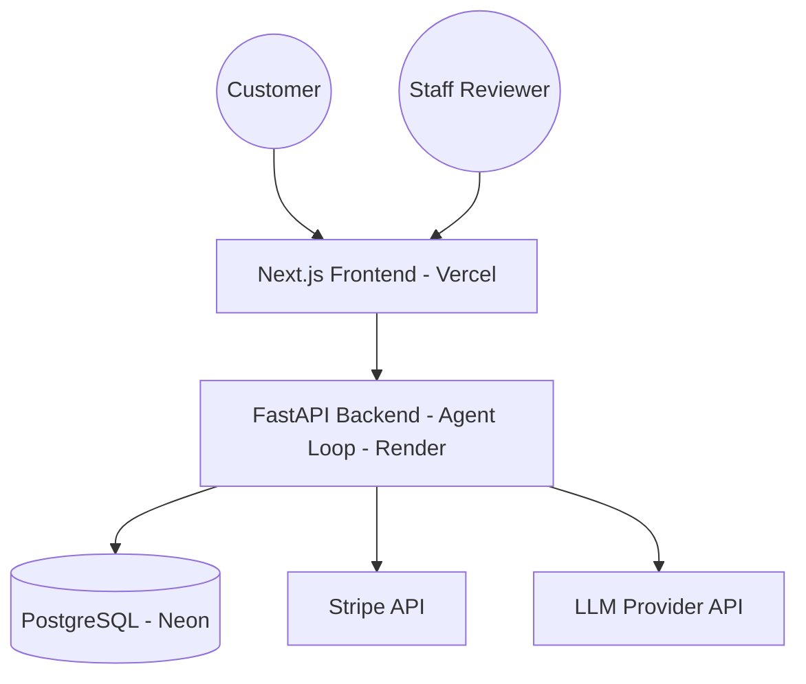
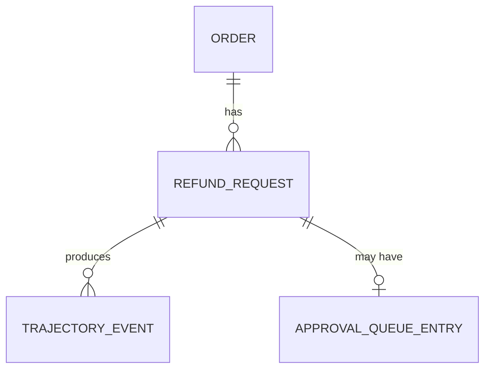

# Architecture Spine — AI Payment Refund Agent

## Design Paradigm

Hexagonal / Ports & Adapters. The Agent Loop (perceive → decide → act → observe) is the domain core and depends on nothing outside it. Everything else is an adapter behind a port the domain defines:

- **Inbound adapters** (drive the domain): Chat UI (customer), Approval Queue UI (staff reviewer) — both via the FastAPI API layer.
- **Outbound adapters** (driven by the domain): Stripe Tool, Order Lookup Tool, LLM Port, Policy/Decision Port, Postgres Repository.



## Invariants & Rules

### AD-1 — Dependency direction

- **Binds:** all
- **Prevents:** domain logic quietly coupling to a specific Tool, LLM provider, or the web framework, making later swaps (e.g. a different payment provider, a different model) a rewrite instead of a plug-in.
- **Rule:** the domain core (Agent Loop) imports only port interfaces it defines itself. Adapters import and implement those ports. Nothing in `domain/` may import from `adapters/` or `api/`.

### AD-2 — Agent Loop entry/exit contract

- **Binds:** FR-3, FR-6, FR-8
- **Prevents:** the Orchestrator (FR-8, post-MVP) requiring a rewrite to wrap the loop as a Sub-agent, and two builds independently inventing incompatible `AgentResult` shapes for the completed vs. escalated case.
- **Rule:** the Agent Loop exposes exactly one entry point, `run(input: RunInput) -> AgentResult`, where `RunInput` is a discriminated union covering both forward execution (`NewRequestInput`) and resuming after Escalation (`ResumeInput(refund_request_id, reviewer_decision)`) — resume is a second `RunInput` variant through the *same* entry point, never a second method. `AgentResult` is a discriminated union with exactly three variants: `Completed{refund_id, amount_cents}`, `Escalated{pending_review_id, tentative_recommendation}`, `Failed{reason: str}`. Any future Orchestrator wraps this same `run()`/`AgentResult` contract per Sub-agent instance — no separate wrapping interface.

### AD-3 — Idempotency: intake-level dedup, then per-request key

- **Binds:** FR-4, FR-6
- **Prevents:** a double-submission (double-click, chat client retry, re-pasted request) creating two distinct `RefundRequest` rows that each pass their own per-row idempotency check — satisfying the letter of dedup while still issuing two refunds.
- **Rule:** two layers, both domain-enforced: (1) **Intake dedup** — before creating a `RefundRequest` row, the domain computes a deterministic dedup key from `(order_reference, normalized_reason, time_window)` and reuses the existing row if one matches; (2) **Per-request Idempotency Key** — the domain then checks and records an Idempotency Key derived from the `RefundRequest` (never the `Order` alone) before invoking any outbound Tool that moves money. Adapters never perform their own independent dedupe at either layer.

### AD-4 — Escalation is asynchronous

- **Binds:** FR-6, FR-7, FR-9
- **Prevents:** a blocking request that ties up a live connection while waiting on a Human Reviewer, and a Trajectory with no durable state to resume from.
- **Rule:** on Escalation, the Agent Loop returns `AgentResult.Escalated` (AD-2), persisting a `pending_review` state including its tentative recommendation (feeds FR-9), and the request ends there. A Human Reviewer's decision re-enters the loop via `run(ResumeInput(...))` — the same entry point, not a separate method.

### AD-5 — Trajectory: append-only, redacted-at-write, explicitly ordered

- **Binds:** FR-3, FR-5, FR-8, FR-9
- **Prevents:** (a) two stages recording steps incompatibly — mutable vs. appended; (b) unredacted Tool/Receipt payloads landing permanently in a table that can never be updated or deleted, turning an ordinary oversight into an unrecoverable PII leak exposed directly through FR-5's debug endpoint and FR-7's Approval UI; (c) step order becoming ambiguous once FR-8's concurrent Sub-agent writers arrive.
- **Rule:** every Agent Loop step (including each Sub-agent's contribution, tagged by name) is inserted as a new, immutable `TrajectoryEvent` row foreign-keyed to its `RefundRequest`, carrying an explicit monotonic `sequence_no` per `refund_request_id` assigned transactionally by the domain core at write time (never by an adapter, never inferred from `created_at`). Rows are never updated or deleted. Each step type has a defined field allowlist — only allowlisted fields may be written; raw Tool-call or Receipt-derived payloads are redacted/summarized by the domain *before* insert, never stored as a free-form blob.

### AD-6 — Policy/Decision Port: fixed return shape, pluggable implementation

- **Binds:** FR-2, FR-6
- **Prevents:** the MVP's hardcoded policy rule set (PRD `PRD-ADDENDUM.md`) hardwiring into the Agent Loop so that FR-2's later RAG-based check becomes a breaking rewrite instead of a swap.
- **Rule:** policy-compliance checking is invoked through the Policy/Decision Port, which always returns `PolicyDecision{compliant: bool, confidence: float, citation_ids: list[str]}` — the MVP hardcoded adapter returns this shape with `citation_ids` empty; the future FR-2 RAG adapter populates it. Callers are written against this shape from the start, never against a bare `bool`.

### AD-7 — Single system of record, single owner of lifecycle status

- **Binds:** FR-1, FR-4, FR-5, FR-7, FR-9
- **Prevents:** (a) Trajectory, Refund Request, or Approval Queue state drifting across separate stores; (b) `RefundRequest.status` and `ApprovalQueueEntry.decision` each becoming a competing "source of truth" for whether a request is approved.
- **Rule:** one PostgreSQL instance holds Orders, Refund Requests, the Trajectory event log, and Approval Queue entries — no new datastore without a new AD. `RefundRequest.status` is the sole canonical lifecycle field; a reviewer decision is written to `ApprovalQueueEntry` and to `RefundRequest.status` in the same domain-core transaction. `ApprovalQueueEntry` is a queue/audit projection — FR-5 and FR-9 read `RefundRequest.status`, never `ApprovalQueueEntry`, as authoritative.

### AD-8 — Confidence Score is domain-computed from raw signals

- **Binds:** FR-6
- **Prevents:** two ports (e.g. Order Lookup returning a pre-baked match-confidence number, vs. the domain expecting to compute confidence itself) each independently "scoring" confidence with different formulas, splitting FR-6's escalation gate across un-swappable, uncoordinated logic.
- **Rule:** ports return only raw signal (e.g. a match score, a policy `PolicyDecision.confidence`, an extraction-quality indicator) — never a final, pre-computed Confidence Score. The domain core is the sole place Confidence Score is computed and compared against the Escalation Threshold. The specific computation mechanism (proposed default: LLM-as-judge self-rating, see PRD `PRD-ADDENDUM.md`) stays swappable behind this same rule.

### AD-9 — Escalation Threshold is versioned, audited data

- **Binds:** FR-6, and the PRD's SM-C1 counter-metric
- **Prevents:** the threshold living as a hardcoded constant, which would make SM-C1's "changes and resulting auto-approval rate are logged over time" unimplementable without reconstructing history from source control.
- **Rule:** the Escalation Threshold (and any per-step-type variants) is stored as data — a table row with an effective-date and changed-by column — read by the domain at decision time and written only through the domain core, never a code constant.

### AD-10 — Agent Loop execution is bounded

- **Binds:** FR-3
- **Prevents:** an unbounded retry/replan loop against a flaky Stripe sandbox or LLM API running indefinitely, silently defeating FR-3's "never a silent failure" guarantee by replacing it with a non-terminating one.
- **Rule:** the domain core enforces a step/retry counter on every `run()` invocation; once exhausted, the loop returns `AgentResult.Escalated` or `AgentResult.Failed` rather than continuing. The specific cap value is Deferred (see below); the bound itself, and its enforcement in the domain core rather than per-adapter retry logic, is not.

### AD-11 — Security baseline applies to every step, everywhere

- **Binds:** all
- **Prevents:** OWASP-aligned guardrails and secret hygiene being treated as one feature's concern (FR-6) rather than a system-wide property, leaving other adapters free to log secrets or skip injection checks.
- **Rule:** every Agent Loop step is defended per OWASP Top 10 for Agentic Applications and OWASP Top 10 for LLM Applications (PRD Cross-Cutting NFRs). API keys and secrets never appear in logs or `TrajectoryEvent` rows (enforced via AD-5's field allowlist). Rate limiting is enforced at the inbound API adapter layer, on both chat submissions and outbound Tool/LLM calls.

### AD-12 — Domain entities are distinct from API schemas

- **Binds:** FR-1, FR-5, FR-7, and Privacy
- **Prevents:** a domain entity gaining an internal-reasoning field (e.g. raw extracted Receipt text, added for FR-10) that then gets silently serialized to every endpoint reusing that entity as its `response_model` — a second, independent PII exposure path alongside AD-5's.
- **Rule:** API request/response schemas in `api/` are distinct types from `domain/` entities, with an explicit field allowlist per endpoint. No endpoint uses a domain entity directly as its `response_model`.

### AD-13 — Episodic memory is owned by the domain, via the Repository port

- **Binds:** FR-4
- **Prevents:** per-customer refund-history lookups getting implemented ad hoc inside individual features instead of through one owned path, risking divergent queries against the same data.
- **Rule:** all reads/writes of a customer's episodic history (past Refund Requests) go through the Postgres Repository port, keyed by customer identifier, called only from the domain core.

## Consistency Conventions

| Concern | Convention |
| --- | --- |
| Naming (entities, files, interfaces, events) | Domain nouns match the PRD Glossary verbatim in code identifiers (`RefundRequest`, `Order`, `Trajectory`, `TrajectoryEvent`, `ApprovalQueueEntry`) — no synonyms. |
| Data & formats (ids, dates, error shapes, money) | IDs: UUIDv4 strings. Timestamps: ISO-8601 UTC. Money: integer cents, never float. API errors: `{ "error": { "code", "message", "details" } }`. |
| State & cross-cutting (mutation, logging, config, auth) | All state mutation goes through the domain core, never directly from an adapter. Structured (JSON) logs for every Trajectory step, subject to AD-5's field allowlist and AD-11's secret hygiene. Config via environment variables, no hardcoded secrets. Approval Queue auth is a no-op/unverified stub in MVP (see Deferred), implemented behind a port — but the decision record always carries a `reviewer_identifier` field from day one (even while unverified), so FR-7's full auth and FR-9's override tracking never need a backfill migration. |

## Stack

| Name | Version |
| --- | --- |
| Python | 3.13+ (current stable line; 3.14 is newer but 3.13 has the broadest library/ecosystem compatibility as of authoring) |
| FastAPI | latest 0.13x.x at implementation time (ships weekly; pin exactly when `pip install` is actually run, not to this document's number) |
| Pydantic (core, not Pydantic AI) | v2 |
| React / Next.js | 16.3.3+ (Active LTS; 16.3.3 patches a disclosed CVE — never pin below it) |
| PostgreSQL | 18.x |
| Frontend hosting | Vercel (Hobby tier — non-commercial use, which fits a portfolio project) |
| Backend app hosting | Render (free web service tier; app itself is stateless, so its sleep/restart behavior costs nothing since state lives in Postgres per below) |
| Database hosting | Neon (Postgres) — its Free plan is a genuinely permanent tier, not a trial: the database is never auto-deleted, unlike Render's bundled free Postgres (deleted after 30 days) or Railway's free tier (one-time trial credit only). Required by AD-7's system-of-record guarantee. |

## Structural Seed

**Environment & operations (minimal, explicit rather than silent):** one `production` environment for this hobby-scale project — no staging tier. Structured JSON logs (Consistency Conventions) are the sole observability floor for MVP; no alerting/on-call is set up (Deferred).





```text
{root}/
  backend/
    domain/        # Agent Loop, port interfaces, core business rules - no external imports
    adapters/       # Stripe Tool, Order Lookup Tool, LLM Port impl, Postgres repository
    api/            # FastAPI routes - inbound adapter, own DTOs (AD-12)
  frontend/
    app/            # Next.js chat UI + Approval Queue UI
```

## Capability → Architecture Map

| Capability / Area | Lives in | Governed by |
| --- | --- | --- |
| FR-1 Chat-based refund submission | `api/`, `frontend/app/` | AD-1, AD-3, AD-12 |
| FR-2 Policy-cited decisions (RAG) | Policy/Decision Port adapter | AD-6 |
| FR-3 Autonomous tool selection | `domain/` Agent Loop | AD-1, AD-2, AD-10 |
| FR-4 Idempotent refund handling | `domain/` (check), Stripe Tool adapter (call) | AD-3, AD-13 |
| FR-5 Inspectable reasoning trajectory | `TrajectoryEvent` table | AD-5, AD-7, AD-12 |
| FR-6 Confidence-gated escalation | `domain/`, Policy/Decision Port | AD-2, AD-4, AD-6, AD-8, AD-9, AD-11 |
| FR-7 Staff approval workflow | `frontend/app/`, `api/` | AD-4, AD-7, AD-12 |
| FR-8 Specialist routing (Orchestrator) | wraps `domain/` Agent Loop instances | AD-2, AD-5 |
| FR-9 Trajectory scoring | reads `TrajectoryEvent` log | AD-5, AD-7 |
| FR-10 Receipt upload/extraction | new inbound path into `domain/`, feeds FR-1 | AD-1, AD-5 |
| Cross-Cutting Security NFR | every Agent Loop step | AD-11 |

## Deferred

- **Approval Queue authentication** — MVP ships with a no-op/unverified auth port (Consistency Conventions); real auth is a future adapter swap, not an architectural change. The decision record's `reviewer_identifier` field is already pinned, so this stays a swap.
- **Model routing / cost-classification rule** — which model handles which step is an implementation-stage decision (PRD Open Question 2); the LLM Port makes any choice here swappable without touching the domain.
- **Specific LLM provider/model** — bound only by the LLM Port interface; provider choice doesn't affect the spine.
- **Orchestrator's routing algorithm (FR-8 internals)** — Should-tier, post-MVP; AD-2's contract already guarantees it can be added without a rewrite.
- **CI/CD pipeline specifics** — Vercel, Render, and Neon all support git-push deploy; exact pipeline config is an implementation detail, not architecturally load-bearing.
- **Multi-tenant/multi-business support** — explicit PRD non-goal; out of this spine's scope entirely.
- **Specific numeric values still open from the PRD** — FR-6's dollar escalation threshold (Open Question 1), the Performance NFR's latency target (Open Question 3), AD-10's step/retry cap (Open Question 6), FR-2's context summarization token budget (Open Question 8). None of these are architectural — AD-9 and AD-10 already fix *where* they're configured and enforced; only the numbers themselves remain open.
- **Alerting/on-call** — no alerting exists for MVP; structured logs are the floor (Structural Seed). Revisit if the project moves past a personal demo.
